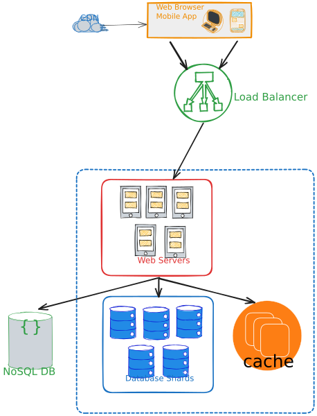

# BittyURL: Your Shortcut to Share and Analyze Links

## Table of Contents

- [BittyURL: Your Shortcut to Share and Analyze Links](#bittyurl-your-shortcut-to-share-and-analyze-links)
  - [Description](#description)
  - [Features](#features)
  - [Requirements](#requirements)
    - [Functional Requirements](#functional-requirements)
    - [Non-Functional Requirements](#non-functional-requirements)
  - [Back-of-the-Envelope Estimation](#back-of-the-envelope-estimation)
  - [Architecture Considerations](#architecture-considerations)
    - [Modular Structure](#modular-structure)
    - [Database Tier](#database-tier)
    - [Load Balancing (Web Tier)](#load-balancing-web-tier)
    - [Cache Tier](#cache-tier)
    - [Stateless Web Tier](#stateless-web-tier)
  - [API Design](#api-design)
    - [URL Shortening](#url-shortening)
      - [Shortening Algorithm](#shortening-algorithm)
    - [Redirection](#redirection)
  - [Monetization Scheme](#monetization-scheme)
  - [Analytics](#analytics)
  - [CDN](#cdn)
  - [Technology Stack](#technology-stack)
    - [Database](#database)
  - [Cost Efficiency](#cost-efficiency)
  - [Resources](#resources)

## Description

BittyURL is a cutting-edge URL shortener service designed to simplify link sharing while offering robust analytics and tracking capabilities. Our mission is to provide users with an intuitive platform to generate short and memorable links, ensuring effortless sharing across various platforms. With a commitment to security and privacy, BittyURL safeguards user data while delivering a seamless experience.

Notes:
- This is a high-level design document.
- ⭐ indicates a feature that is a premium offering.

## Features:

- **Link Shortening**: BittyURL allows users to shorten any link to a memorable and easy-to-share format.
- **⭐ Link Analytics**: BittyURL provides users with detailed analytics on their links.
- **⭐ Link Management**: BittyURL allows users to manage their links by editing, deleting, and viewing their links.
- **Privacy and Security**: BittyURL is committed to protecting user data and privacy.
- **Scalability**: BittyURL is built on a scalable architecture that can handle a large volume of requests.

## Requirements:

### Functional Requirements:

- Given a long URL, BittyURL should generate a short URL.
- Given a short URL, BittyURL should redirect the user to the original URL.
- ⭐ Custom URLs: Users can customize their links to create a personalized experience.
- ⭐ Analytics: BittyURL should provide users with detailed analytics on their links.

### Non-Functional Requirements:

- The service should be able to handle a large volume of traffic without any downtime or performance issues.
- ⭐ REST API for integration with other services.

## Back-of-the-Envelope Estimation:

- **Will it ever expire?**: No, the links will never expire, unless the user deletes them.
- **Traffic Estimation (write operations)**: 1 billion write operations per month, 33 million per day, 23,000 per minute, 385 per second.
- **Read to Write Ratio**: 10:1
- **Traffic Estimation (read operations)**: 10 billion read operations per month, 333 million per day, 230,000 per minute, 3.8,000 per second.
- **Projected Data Volume**: Assume BittyURL will run for 10 years, 1B * 10 * 12 = 120 billion records.
- **Data object size**: Assume 500 bytes per object, 120B * 500 = 60 TB.
- **Cache size**: Assume 20% of the data is hot, 60 TB * 20% = 12 TB.
- **BittyURL length**: 7 characters
- **Allowed characters**: 62 characters (a-z, A-Z, 0-9)
- **Total number of possible combinations**: 62^7 = 3.5 trillion, 3.5T > 120B, so we are good.

## Architecture Considerations:



### Modular Structure:

- Divide the application into logical modules: URL shortening, analytics, user management, and frontend.
- Maintain clean separation between different modules using well-defined APIs and interfaces.

### Database Tier:

- **Database Replication:**
  - Replicate the database to ensure high availability and fault tolerance.
  - Use a master-slave replication setup where the master handles write operations, and the slaves handle read operations.
  - Replication enhances read scalability by distributing read requests across multiple replicas. 
- **Load Balancing:**
  - Use a load balancer in front of the read replicas to distribute read requests evenly.
  - Use a least-connections algorithm to balance the load.
- **Database Scaling:**
  - Sharding is a technique to horizontally partition data across multiple databases.
  - Sharding strategy: Hash-based sharding, hash of the original URL is used to determine the database shard.

### Load Balancing (Web Tier):

- A load balancer evenly distributes incoming traffic among web servers that are defined in a load-balanced set.
- LB communicates with the web servers using a private IP address, for better security.

### Cache Tier

   - Cache type: Distributed global caching, allows multiple servers to share the workload of storing and retrieving data.
   - Cache eviction policy: Least Recently Used (LRU), removes the least recently used items first.
   - Cache replacement policy: Read-Through, the cache is used as the primary data source;
     - the cache is checked first,
     - If the data is in the cache, it is returned to the client.
     - If the data is not in the cache, it is returned from the database 
     - And stored in the cache for future use.
   - Mitigating failures: Use multiple cache servers, avoid single point of failure (SPOF).

### Stateless Web Tier:

- The web tier is stateless, which means that the web servers do not store any user-related data.
- Store session data (for example user session) in the persistent shared data store (NoSQL database).
- State data is stored in a shared data store and kept out of web servers.
- Use NoSQL data store is chosen for its ease of scalability.

## API Design:

### URL Shortening:

- **POST /api/shorten**: Given a long URL, an optional custom URL, and an access token, generate a short URL.
- **GET /{shortened_url}**: Given a short URL, redirect the user to the original URL.
- **GET /api/analytics/{shortened_url}**: Get analytics for a shortened URL.

#### Shortening Algorithm:

- **Hashing**: Hash the original URL to generate a unique hash value.
- To avoid collisions, use Base62 encoding to generate a unique hash value.
- **Algorithm**:
  - Input Long URL
  - If Long URL is present in the database, return the corresponding Short URL.
  - Else, generate a unique ID using unique ID generator. _Designing a unique ID generator is out of scope for this project._
  - Encode the unique ID using Base62 encoding.
  - Store the Long URL and Short URL in the database.

```python
import string

BASE62 = string.ascii_letters + string.digits

def encode(num, alphabet=BASE62):
    """Encode a positive number in Base X

    Arguments:
    - `num`: The number to encode
    - `alphabet`: The alphabet to use for encoding
    """
    if num == 0:
        return alphabet[0]
    arr = []
    base = len(alphabet)
    while num:
        rem = num % base
        num = num // base
        arr.append(alphabet[rem])
    arr.reverse()
    return ''.join(arr)

def decode(text, alphabet=BASE62):
    """Decode a Base X encoded text into the number

    Arguments:
    - `text`: The encoded text
    - `alphabet`: The alphabet to use for encoding
    """
    base = len(alphabet)
    strlen = len(text)
    num = 0

    idx = 0
    for char in text:
        power = (strlen - (idx + 1))
        num += alphabet.index(char) * (base ** power)
        idx += 1

    return num

```

### Redirection:

- **301 Moved Permanently**: The requested resource has been assigned a new permanent, the browser caches the response, and subsequent requests for the same URL will not be sent to the URL shortening service.
- **302 Moved Temporarily**: The requested resource resides temporarily under a different URL, the browser does not cache the response, and subsequent requests for the same URL will be sent to the URL shortening service.
- As Analytics is a premium feature, **we will use 302 redirection** to ensure that the request is sent to the URL shortening service.

## Monetization Scheme:

BittyURL offers a tiered monetization model to cater to different user needs:

- **Free**: The free tier allows users to shorten links and view basic analytics.
- **Premium**: The premium tier allows users to shorten links, view detailed analytics, and customize their links.
- **Enterprise**: Tailored plans with dedicated support and enhanced scalability for businesses.

## Analytics:
- **Analytics Dashboard**: The analytics dashboard provides users with detailed analytics on their links.
- **Analytics API**: The analytics API allows users to integrate BittyURL analytics with other services.
- **Analytics Metrics**: BittyURL provides the following metrics:
  - **Total Clicks**: Total number of clicks on the link.
  - **Unique Clicks**: Total number of unique clicks on the link.
  - **Clicks by Country**: Total number of clicks by country.
  - **Clicks by Platform**: Total number of clicks by platform.
  - **Clicks by Browser**: Total number of clicks by browser.
  - **Clicks by Datetime**: Total number of clicks by date.
  - **Clicks by Device**: Total number of clicks by device.

## CDN:

- A CDN is a geographically distributed group of servers that work together to provide fast delivery of Internet content.
- CDN stores a cached version of the static content in multiple geographical locations.
- CDN delivers content to end-users with high availability and high performance.
- CDN reduces latency by reducing the distance between the user and the server.
- CDN reduces bandwidth costs by reducing the load on the origin server. Which reduce the cost of hosting the website.
- CDN improves security by providing DDoS mitigation, and load balancing

## Technology Stack:

### Database:

- Use Relational Database for storing user data.
  - Structured Data: RDBMS (PostgreSQL) are well-suited for structured data storage, which aligns with the structured nature of URL shortener data (short links, user information, analytics).
  - Data Integrity: ACID compliance ensures accurate and consistent data storage.
  - Complex Queries: Powerful SQL capabilities for analytics and complex queries.
- PostgreSQL?
  - Maturity and Stability: PostgreSQL has a long history and a reputation for stability and reliability, crucial for a service that will run for a decade.
  - High Availability (HA): PostgreSQL supports failover and standby servers, ensuring minimal downtime and high availability for your service.
  - Replication: Built-in replication features include streaming replication and logical replication, enabling you to distribute read traffic and enhance availability.
  - Scalability: PostgreSQL supports horizontal scalability through sharding, which is a key requirement for a service that will handle a large volume of traffic.
  - Security: PostgreSQL has a reputation for security and is trusted by organizations worldwide.
  - Community: PostgreSQL has a large and active community, which is crucial for a service that will run for a decade.
  - Cost: PostgreSQL is open-source and free to use, which is a key consideration for a service that will run for a decade.

## Cost Efficiency:

- **Database**: PostgreSQL is open-source and free to use, which is a key consideration for a service that will run for a decade.
- **Cache**: Redis is open-source and free to use, which is a key consideration for a service that will run for a decade.
- **CDN**: Cloudflare offers a free tier, which is a key consideration for a service that will run for a decade.

## Resources:

- System Design Interview – An insider's guide
- [Google Pro Tip: Use Back-Of-The-Envelope-Calculations To Choose The Best Design](http://highscalability.com/blog/2011/1/26/google-pro-tip-use-back-of-the-envelope-calculations-to-choo.html)
- [Numbers Everyone Should Know](http://highscalability.com/numbers-everyone-should-know)
- [CS75 (Summer 2012) Lecture 9 Scalability Harvard Web Development](https://www.youtube.com/watch?v=-W9F__D3oY4)
- [Scaling Postgres podcast](https://www.youtube.com/playlist?list=PLdTaEgcmPg9Kl539gyIFtWL0-cqk3m7v9)
- [System Design : Scalable URL shortener service like TinyURL](https://medium.com/@sandeep4.verma/system-design-scalable-url-shortener-service-like-tinyurl-106f30f23a82)
- [Why are relational databases having scalability issues?](https://stackoverflow.com/questions/12215002/why-are-relational-databases-having-scalability-issues)
- [Load Balancing Algorithms](https://www.designgurus.io/course-play/grokking-system-design-fundamentals/doc/641db0dec48b4f7de900fd04)
- [Grokking System Design: What is Database Sharding?](https://medium.com/codex/grokking-system-design-what-is-database-sharding-97830014baab)
- [Cache Strategy](https://medium.com/@mmoshikoo/cache-strategies-996e91c80303)
- [Caching patterns using redis](https://docs.aws.amazon.com/whitepapers/latest/database-caching-strategies-using-redis/caching-patterns.html)
- [Stateful vs Stateless Architecture – Explained for Beginners](https://www.freecodecamp.org/news/stateful-vs-stateless-architectures-explained/)